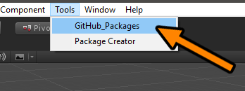
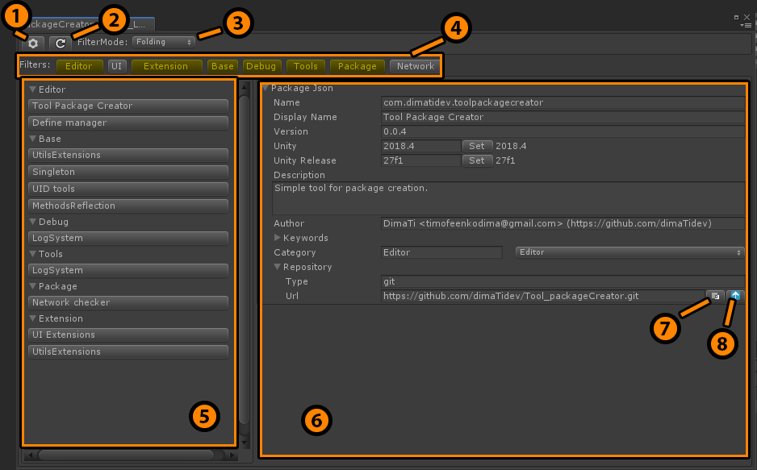

# Unity Github package management
Window with all packages from your account. Easy to sort, foldout, and group together. You can see ONLY repositories with package.json.

# Dependencies
```json
  "com.dimatidev.toolpackagecreator": "https://github.com/dimaTidev/Tool_packageCreator.git#0.0.4",
  "com.unity.editorcoroutines": "1.0.0"
```

# How to Use
* Open window <br />


* Explore window <br />


1. Settings - for enter gitHub [personal token](https://github.com/settings/tokens)
2. Refresh button - request list of repos and download all package.jsons for management
3. FilterMode - how your repos shown in 5.
4. Filters - this filters base on `keywords` from all `package.json`'s from your repos,
5. Repo buttons
6. Package.json - from selected repo (can't edit, only for watch and copy info)
7. Copy Url
8. Open Url in browser - if you type in package.json url to your repo, this button fast redirect your to repo 

# How it works
* For work you have to enter your gitHub [personal token](https://github.com/settings/tokens)
* Your token store in your project!!! in Assets/.5673234568
* When window OnEnable -> if `first` start in this session, window request repo list from github, download `package.json`'s and save this data in `your project` in `temp/` (refresh button have the same logic)
* When window OnEnable -> if `not first` start in this session, window `NOT request` data from gitHub. All data `loading` from `temp/` (for refresh use button (2.) `Refresh`)

# Best practices
Use next dependencies for easy download and resolve packages 
```json
    "com.coffee.upm-git-extension": "https://github.com/mob-sakai/UpmGitExtension.git",
    "com.coffee.git-dependency-resolver": "https://github.com/mob-sakai/GitDependencyResolverForUnity.git"
```
